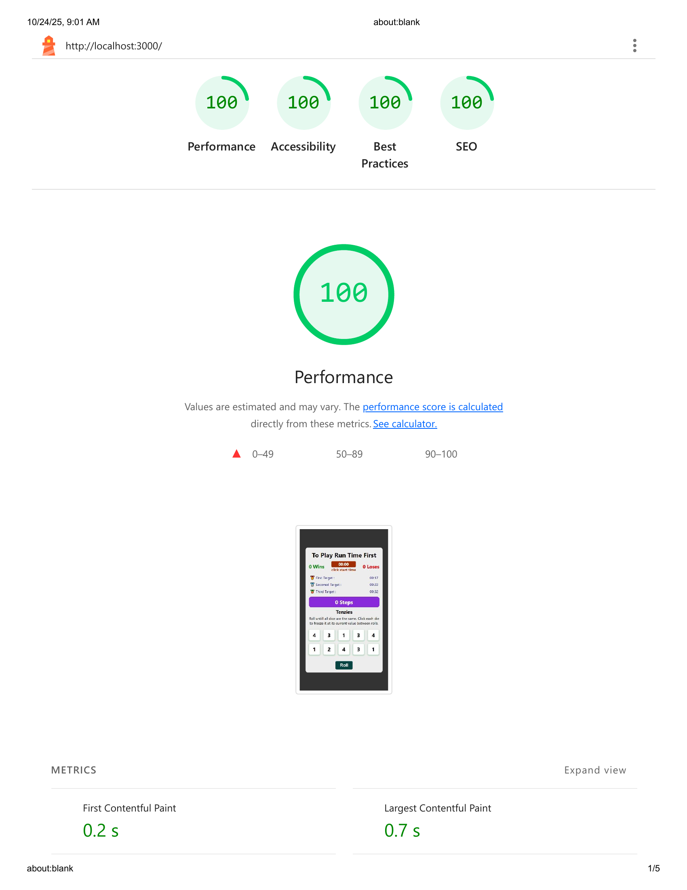
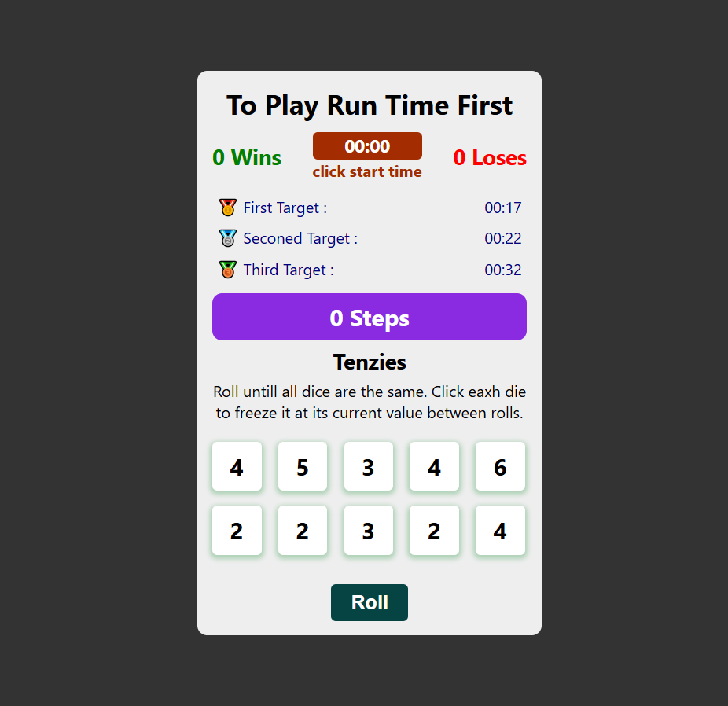

# 🎲 Tenzies Game — React Edition

A fun and interactive dice game built with **React.js**.  
Roll the dice, match all numbers, and race against time to achieve the best score!  
Includes animations, a live timer, win tracking, and persistent records saved locally.

---

🚀 Live Demo

👉 [https://github.com/ahmednabil22224/tenzies-react-game.git](https://ahmednabil22224.github.io/tenzies-react-game/)
 
---

## 🌟 Features

- 🎯 **Core Gameplay** — Roll until all dice show the same value.
- 🧮 **Step Counter** — Tracks how many rolls you took to win.
- ⏱️ **Live Timer** — Starts manually, pauses and resets automatically on win.
- 🏆 **Leaderboard** — Saves your top 3 fastest times locally using `localStorage`.
- 🎨 **Dynamic UI** — Color-coded dice, responsive layout, and smooth transitions.
- 🎉 **Celebration Animation** — Moving background and confetti appear when you win.
- 🔄 **Reset & New Game** — Quick restart without refreshing the page.
- 🧠 **Smart State Management** — Managed using React Context and Hooks.

---

## 🧩 Tech Stack

| Area                   | Technologies                                              |
| ---------------------- | --------------------------------------------------------- |
| **Frontend Framework** | React.js (Hooks + Context API)                            |
| **Styling**            | CSS3 (Flexbox, Grid, Variables, Animations)               |
| **Language**           | JavaScript (ES6+)                                         |
| **State Management**   | React Context + Hooks (`useState`, `useEffect`, `useRef`) |
| **Persistence**        | Browser LocalStorage                                      |
| **UX Enhancements**    | Confetti animation, background effects                    |

---

## 🚀 Getting Started

### 1️⃣ Clone this repository

```bash
git clone https://github.com/ahmednabil22224/tenzies-react-game.git
cd tenzies-react-game
```

---

2️⃣ Install dependencies
npm install

---

3️⃣ Run the app locally
npm start

Then open http://localhost:3000 in your browser 🎮

---

⚙️ Project Structure

```
src/
 ├── App.js
 ├── components/
 │    ├── Header.js
 │    ├── Main.js
 │    ├── Target.js
 │    ├── FullNums.js
 │    ├── NumBox.js
 ├── context/
 │    └── TimeContext.js
 ├── images/
 │    ├── tenzies-react-game.png
 │    └── lighthouse-report.png
 ├── index.js
 └── App.css
```

---

🧠 Key Learnings

. How to structure a React app using Context API for global state.

. Handling game logic and UI updates with React Hooks.

. Managing timers and intervals efficiently using useRef.

. Using localStorage for client-side persistence.

. Creating animations and effects for better UX.

---

## 🌟 Lighthouse Report

| Metric            | Score |
| ----------------- | ----- |
| ⚡ Performance    | 100%  |
| ♿ Accessibility  | 100%  |
| 🛡️ Best Practices | 100%  |
| 🔍 SEO            | 100%  |

images/lighthouse-report.png

## ⚡ Lighthouse Report



## 📸 Preview


